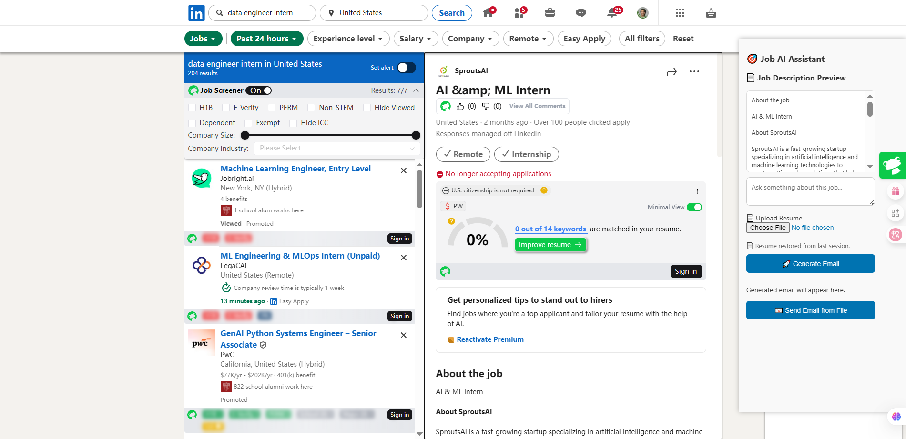
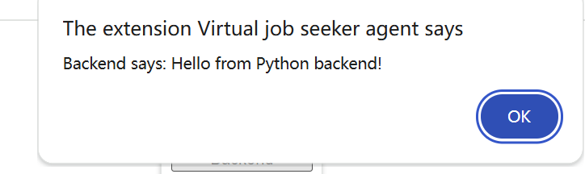

# Chrome Extension + Python Backend 

## 启动方式
1. 命令行启动后端  
    进入 `backend/` 目录，运行 `python server.py` 文件，启动后端服务
2. 进入Chrome扩展（也叫‘插件’）：在浏览器右上角，点击 'Extensions图标 ——— Manage Extensions'，进入'Extensions'，打开页面右上角开发者模式'Developer mode'，点击'Load unpacked'，加载 extension/ 目录，可看到我们的'Virtual job seeker agent 1.0'扩展成功导入
3. 点击我们的'Virtual job seeker agent 1.0'扩展弹窗按钮，会弹出'Hello, Chrome Extension!'黑体字样

4. 继续点击'Send to backend'，有弹窗显示'Backend says: Hello from Python backend.'表明全部跑通成功！

（原理大致解释：前端会通过 `fetch` 请求访问本地 5000 端口，后端监听5000端口，并从5000端口发送信息给前端）

> **说明：**  
> - 后端（`server.py`）会一直监听本地 5000 端口。  
> - 只有当前端（Chrome 扩展）点击按钮时，前端的 JS 代码才会通过 HTTP 请求访问后端。  
> - 此时后端才会响应，并返回 “Hello from Python backend！”

## 目录结构
- extension/  Chrome扩展前端
- backend/    Python后端
- samples/    示例数据和对话样例（如：chatbot_dialog_sample.txt）

## 项目任务分拆

### 后端
- 提供本地 HTTP 服务，监听 5000 端口的上传内容。
- 接收前端上传（先用示例数据）的简历文件和岗位描述文本。
- 示例数据：`samples/user_resume_sample.txt` ，`samples/jobdescription_sample.txt`
- 将简历和岗位描述（system prompt），发送给大语言模型（如 OpenAI GPT），如果有用户提问的话，把用户提问的上下文一起发送给大语言模型
- 获取大语言模型生成的邮件内容
- 用 mcp 发送邮件并将结果返回给前端。

### 前端（Chrome Extension）
- 调研一下网上有什么chatbot frontend开源代码可以用在chrome extension里，选一个用
- 实现Chatbot基础界面，示例数据 amples/chatbot_dialog_sample.txt` 
- 支持用户上传本地简历文件，并保存在 chrome extension storage 里
- 在领英岗位页面，自动获取岗位描述内容。
- 将简历和岗位描述（system prompt），用户提问等，通过 HTTP 请求发送到本地后端（localhost:5000）。
- 接收后端返回的大语言模型生成的邮件内容，并展示给用户
- 一个发送邮件的按钮，接收后端的邮件是否发送成功的结果，并展示给用户

## 未来再做的

### 1. 支持多用户的远程服务器部署
- 将 Python 后端部署到云服务器（如 AWS、阿里云、腾讯云等），开放公网端口，支持多个用户同时访问

### 数据追踪与用户历史面板
- 前端增加“数据追踪”面板，展示用户已申请岗位数量、已发送邮件数量等历史数据。
- 每次用户成功申请岗位或发送邮件后，前端将相关数据记录到 Chrome extension storage。
- 数据追踪面板可随时查看历史统计信息，便于用户了解自己的求职进展。
- 前端根据用户的求职历史，自动判断是否需要进行 follow up，并通过 HTTP 请求通知后端。
- 后端收到请求后，生成并推送 follow up 邮件提醒，提升用户的跟进效率。

## 注意事项
- Python后端仅为演示，未做多线程/异常处理。
- 前端与后端通信需允许CORS，生产环境请加强安全性。
