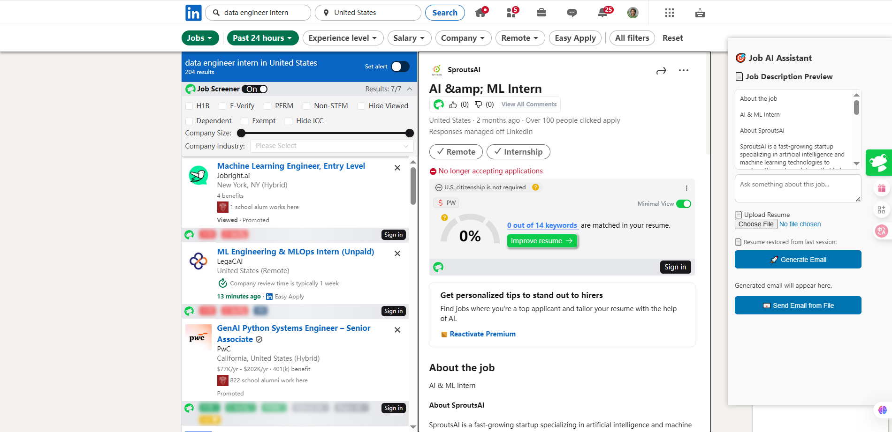
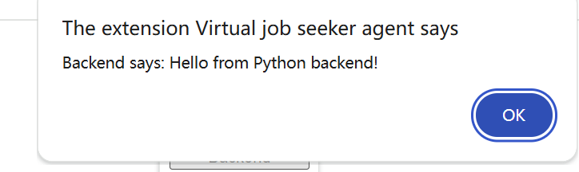
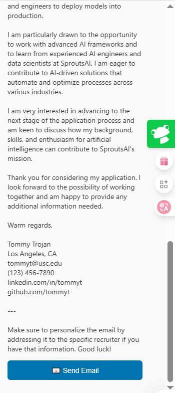

# Chrome Extension + Python Backend 

## 🚀 快速开始

### 1. 环境准备

确保你已安装：
- Python 3.8+
- pip
- Chrome浏览器

### 2. 克隆和安装

```bash
# 克隆项目
git clone <your-repo-url>
cd VirtualJobSeekerAgent

# 创建虚拟环境
python -m venv agent_env

# 激活虚拟环境
# Windows:
agent_env\Scripts\activate
# macOS/Linux:
source agent_env/bin/activate

# 安装依赖
pip install -r requirements.txt
```

### 3. 环境配置

```bash
# 复制环境变量模板
cp .env.example .env

# 编辑 .env 文件，至少设置：
# GOOGLE_CLIENT_ID=your-google-oauth-client-id
# ENVIRONMENT=local
```

### 4. 构建配置文件

```bash
# 生成 manifest.json 和 config.js
python build_manifest.py
```

你应该看到类似输出：
```
🔨 开始构建配置文件...
✅ 成功生成 frontend/manifest.json
✅ 成功生成 frontend/config.js (环境: local -> LOCAL)
🎉 所有配置文件构建完成！
```


## 🛠️ 故障排除

### 502错误
1. **检查环境配置**：
   ```bash
   # 访问健康检查端点
   curl -H "X-From-Extension: true" http://127.0.0.1:5000/health
   ```

2. **检查前端URL配置**：
   - 确认 `frontend/config.js` 中的URL配置正确
   - 前端会自动尝试本地连接，失败后切换到云端

3. **检查CORS设置**：
   - 本地环境允许 `http://127.0.0.1:5000`
   - 生产环境允许 Railway域名

### 本地无法访问
1. **检查环境变量**：
   ```bash
   # 不设置ENVIRONMENT或设置为local
   unset ENVIRONMENT
   # 或
   export ENVIRONMENT=local
   ```

2. **检查端口占用**：
   ```bash
   # Windows
   netstat -ano | findstr :5000
   # macOS/Linux
   lsof -i :5000
   ```

3. **检查防火墙设置**：
   - 确保端口5000未被防火墙阻止

### Chrome扩展连接问题
1. **检查manifest.json权限**：
   ```json
   {
     "permissions": [
       "http://127.0.0.1:5000/*",
       "http://localhost:5000/*"
     ]
   }
   ```

2. **重新加载扩展**：
   - 在Chrome扩展管理页面重新加载扩展

### 环境自动检测问题
如果自动检测环境不准确，可以手动设置：
```bash
# 本地开发
export ENVIRONMENT=local

# 生产部署  
export ENVIRONMENT=production
```

## 注意事项
- Python后端仅为演示，未做多线程/异常处理。
- 前端与后端通信需允许CORS，生产环境请加强安全性。
- 建议在生产环境使用HTTPS和更严格的CORS策略。``bash
OPENAI_API_KEY=YOUR_OPEN_AI_KEY
GOOGLE_CLIENT_ID=YOUR_CLIENT_ID # xxxx.apps.googleusercontent.com
GMAIL_MCP_CREDS_PATH=PATH_TO_FILE # ....\credentials.json, downloaded from GCP After creating client

# 可选：手动指定环境 (通常会自动检测)
# ENVIRONMENT=local    # 本地开发
# ENVIRONMENT=production    # 生产部署
```


### Google OAuth 配置说明

1. 前往 [Google Cloud Console](https://console.cloud.google.com/) 创建或选择一个项目。
2. 导航到“API 和服务” > “凭据”，点击“创建凭据” > “OAuth 2.0 客户端 ID”。
3. 选择“应用类型”为 **Chrome 应用扩展程序**。
4. 在“名称”处填写扩展名称，在“已授权的 JavaScript 来源”中添加：
    ```
    chrome-extension://<your_extension_id>
    ```
    其中 `<your_extension_id>` 可在 Chrome 扩展开发者模式下加载后获得。
5. 配置完成后，在右边侧边栏Data Access（数据访问）页面添加范围（共四个）：
    非敏感：
    ./auth/userinfo.email
    ./auth/userinfo.profile
    .openid
    受限：
    ./auth/gmail.modify

6. 创建后，复制生成的 **客户端 ID**，填写到 `.env` 文件的 `GOOGLE_CLIENT_ID` 字段：
    ```env
    GOOGLE_CLIENT_ID=your_actual_google_client_id
    ```
7. 保存 `.env` 文件，后续即可通过 Google OAuth 登录。

> 详细步骤可参考 [Google 官方文档](https://developers.google.com/identity/protocols/oauth2)。


8. **生成 manifest.json和config.js
 ```bash
   echo "ENVIRONMENT=local" >> .env
   python build_manifest.py
   ```
   生成 `frontend/manifest.json` 文件，并检查是否正确。
   确保 `frontend/manifest.json` 文件中 `"permissions"` 字段包含 `"http://127.0.0.1:5000/*"` 和 `"http://localhost:5000/*"`。


### 启动方式
1. 命令行启动后端  
    进入 `backend/` 目录，运行 `python server.py` 文件，启动后端服务
2. 进入Chrome扩展（也叫‘插件’）：在浏览器右上角，点击 'Extensions图标 ——— Manage Extensions'，进入'Extensions'，打开页面右上角开发者模式'Developer mode'，点击'Load unpacked'，加载 frontend/ 目录，可看到我们的'Job seeker agent 1.0'扩展成功导入
3. 打开Linkedin Job，应该会自动加载侧边栏

4. 上传简历，点击生成邮件，然后再点击发送（注意真的会发到email_content.json中指定的邮箱！）                                                              



（原理大致解释：前端会通过 `fetch` 请求访问本地 5000 端口，后端监听5000端口，并从5000端口发送信息给前端）

> **说明：**  
> - 后端（`server.py`）会一直监听本地 5000 端口。  
> - 只有当前端（Chrome 扩展）点击按钮时，前端的 JS 代码才会通过 HTTP 请求访问后端。  


### Railway 部署

1. **准备部署**：
   ```bash
   # 设置生产环境
   echo "ENVIRONMENT=production" >> .env
   python build_manifest.py
   ```

2. **Railway 配置**：
   - 连接GitHub仓库
   - 设置环境变量：
     ```
     ENVIRONMENT=production
     GOOGLE_CLIENT_ID=your-production-client-id
     OPENAI_API_KEY=your-openai-key
     ```

3. **自动部署**：
   - 推送代码到GitHub
   - Railway自动构建和部署


## 目录结构
- frontend/   Chrome扩展前端
- (已废除)extension/  Chrome扩展前端
- backend/    Python后端
- samples/    示例数据和对话样例（如：chatbot_dialog_sample.txt）


## 项目任务分拆

### 后端
- 提供本地 HTTP 服务，监听 5000 端口的上传内容。
- 接收前端上传（先用示例数据）的简历文件和岗位描述文本。
- 示例数据：`samples/user_resume_sample.txt` ，`samples/jobdescription_sample.txt`
- 将简历和岗位描述（system prompt），发送给大语言模型（如 OpenAI GPT），如果有用户提问的话，把用户提问的上下文一起发送给大语言模型
- 获取大语言模型生成的邮件内容
- 用 mcp 发送邮件并将结果返回给前端。


### 前端（Chrome Extension）
- 调研一下网上有什么chatbot frontend开源代码可以用在chrome extension里，选一个用
- 实现Chatbot基础界面，示例数据 amples/chatbot_dialog_sample.txt` 
- 支持用户上传本地简历文件，并保存在 chrome extension storage 里
- 在领英岗位页面，自动获取岗位描述内容。
- 将简历和岗位描述（system prompt），用户提问等，通过 HTTP 请求发送到本地后端（localhost:5000）。
- 接收后端返回的大语言模型生成的邮件内容，并展示给用户
- 一个发送邮件的按钮，接收后端的邮件是否发送成功的结果，并展示给用户

## 未来再做的

### 1. 支持多用户的远程服务器部署(不做了暂时)
- 将 Python 后端部署到云服务器（如 AWS、阿里云、腾讯云等），开放公网端口，支持多个用户同时访问，记得更新 gcp 授权的重定向链接

### 2. 邮件发送功能（这个要做）
- 发邮件时提示用户有多个可能的收件人，给用户选择


### 数据追踪与用户历史面板（不做了暂时）
- 前端增加“数据追踪”面板，展示用户已申请岗位数量、已发送邮件数量等历史数据。
- 每次用户成功申请岗位或发送邮件后，前端将相关数据记录到 Chrome extension storage。
- 数据追踪面板可随时查看历史统计信息，便于用户了解自己的求职进展。
- 前端根据用户的求职历史，自动判断是否需要进行 follow up，并通过 HTTP 请求通知后端。
- 后端收到请求后，生成并推送 follow up 邮件提醒，提升用户的跟进效率。


## 注意事项
- Python后端仅为演示，未做多线程/异常处理。
- 前端与后端通信需允许CORS，生产环境请加强安全性。
