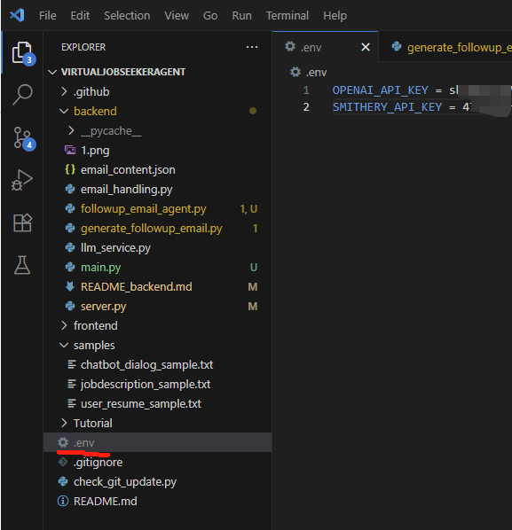

# Virtual Job Seeker Agent (Powered by Aurite)

一个基于 Aurite 框架 构建的智能求职跟进邮件系统。它通过结构化大语言模型（LLM）读取用户简历与岗位描述，自动生成跟进邮件内容，用户可多轮修改邮件，最终自动调用 Gmail MCP 发送邮件。支持 Chrome 插件调用。

## 1. 环境配置

1) 在根目录下创建 `.env` 文件并设置以下环境变量

```env
OPENAI_API_KEY=your_openai_key_here
SMITHERY_API_KEY=your_smithery_key_here
```
2) 安装依赖
```bash
pip install aurite==0.3.18 openai python-dotenv flask flask-cors
```

## 2. Agent 结构与工作流

后端共使用了 **三个 Agent**：

| Agent 名称               | 来源       | 定义文件                      | 类型               | 功能说明                              |
|--------------------------|------------|-------------------------------|--------------------|---------------------------------------|
| Followup Email Generator | 自定义 LLM | `followup_email_agent.py`     | 结构化输出 Agent   | 根据简历和 JD 生成初始邮件草稿        |
| Email Revision Agent     | 自定义 LLM | `llm_and_agent_config.py`     | 文本处理 Agent     | 根据用户修改指令多轮迭代润色邮件内容  |
| MCP Gmail Sender         | 外部 MCP   | `email_handling.py`           | MCP 工具 Agent     | 将最终邮件通过 MCP Gmail Server 发送 |

---

## 3. 文件结构说明

| 文件名                      | 说明 |
|-----------------------------|------|
| `server.py`                 | Flask 后端主入口，定义了所有接口（如 `/generate_email`、`/send-email`） |
| `followup_workflow.py`     | 工作流管理，调用生成邮件 Agent 和发送流程 |
| `followup_email_agent.py`  | 定义结构化输出的 LLM Agent，用于初步生成邮件 |
| `llm_and_agent_config.py`  | 定义修改邮件内容的 Revision Agent |
| `email_handling.py`        | 集成 MCP Gmail Server 发送邮件流程（含注册、调用代理） |
| `test.py`                  | 模拟整个邮件生成 ➝ 多轮修改 ➝ 最终发送流程 |
| `email_content.json`       | 存储本地测试的邮件 JSON 示例（包括收件人、正文等） |
| `env_screenshot.png`       | 运行环境截图（可忽略） |

---
